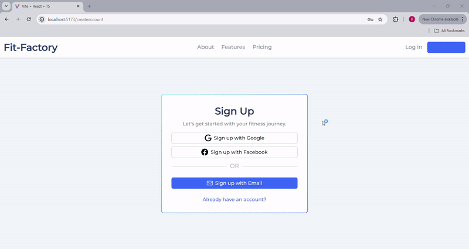

# Fit-Factory
Fit-Factory is a MERN stack-based fitness application aimed at assisting users in achieving their health and fitness objectives. The app offers pre-designed workouts and nutrition plans while allowing trainers to create, modify, and delete these plans to suit users.

Start up

To run first type "npm install" in the root directory, the nodejs directory and the react-app directory. Then, type the command "npm run dev" in the root directory to run the client and server. Click the link generated in the terminal to arrive at the home page. 

The home page of Fit-Factory welcomes users with a clean and motivational interface. It highlights the main features of the application, encouraging users to take control of their health.

The sign-up page provides a seamless onboarding experience for new users. The clean and simple design makes it easy for users to create an account and get started with their health and fitness goals.

The nutrition plans feature allows users to craft highly specific nutrition plans through an interactive page. The plans are organized and can be sorted based on macronutrient content. This section showcases a variety of meal options with detailed descriptions, helping users select the best nutrition plan according to their dietary needs. MongoDB is used for efficient data storage, while React.js ensures dynamic user interactions.

The personalized workout plans module enables users to generate and access tailored workout plans. Users can save, rate, and comment on different workout regimes, fostering a community-driven approach to fitness.

